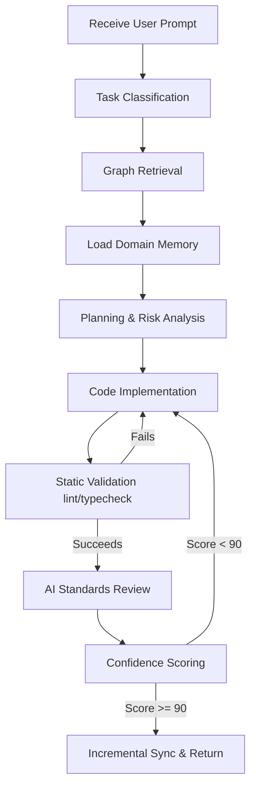

# Project Brain Workflow — Execution States

This file outlines the sequential stages of the prompt resolution lifecycle.

---

## 1. Context Loading
- Parse `/project-brain/graph/graph.json` to extract connected nodes.
- Load selective `.md` files from `/project-brain/memory/` based on matched nodes.

## 2. Static Validation
- Clean compilation check: `pnpm run typecheck`
- Linter checks: `pnpm run lint`

## 3. Knowledge Sync
- Write changes to affected memory pages only.
- Add entry to `/project-brain/tasks/completed.md`.
- Incrementally update node mappings in the graph.
